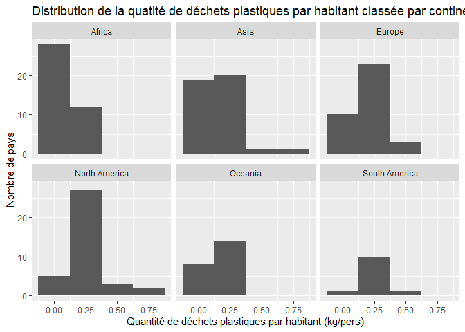

Lab 02 - Plastic waste
================
Lily-Mai Blais
15-09-2025

## Chargement des packages et des données

``` r
library(tidyverse) 
```

``` r
plastic_waste <- read_csv("data/plastic-waste.csv")

ggplot(data = plastic_waste, aes(x = plastic_waste_per_cap)) +
  geom_histogram(binwidth = 0.2)
```

    ## Warning: Removed 51 rows containing non-finite outside the scale range
    ## (`stat_bin()`).

<!-- -->

``` r
plastic_waste %>%
  filter(plastic_waste_per_cap > 3.5)
```

    ## # A tibble: 1 × 10
    ##   code  entity              continent     year gdp_per_cap plastic_waste_per_cap
    ##   <chr> <chr>               <chr>        <dbl>       <dbl>                 <dbl>
    ## 1 TTO   Trinidad and Tobago North Ameri…  2010      31261.                   3.6
    ## # ℹ 4 more variables: mismanaged_plastic_waste_per_cap <dbl>,
    ## #   mismanaged_plastic_waste <dbl>, coastal_pop <dbl>, total_pop <dbl>

Commençons par filtrer les données pour retirer le point représenté par
Trinité et Tobago (TTO) qui est un outlier.

``` r
plastic_waste <- plastic_waste %>%
  filter(plastic_waste_per_cap < 3.5)
```

## Exercices

### Exercise 1

``` r
ggplot(plastic_waste, aes(x = plastic_waste_per_cap )) +
  geom_histogram(binwidth = 0.25) +
  facet_wrap(~ continent) +
  labs(title = "Distribution de la quatité de déchets plastiques par habitant classée par continent",
       x = "Quantité de déchets plastiques par habitant (kg/pers)",
       y = "Nombre de pays") 
```

<!-- --> Avec
la distribution suivante, on peut observer que la majorité des pays
d’Asie, d’Europe, d’Amérique du Sud et d’Amérique du Nord semblent une
quantité de déchets par habitant qui tourne autour de 0,25 kg/pers. On
voit qu’en Afrique, la majorité des pays ont une quantité de déchets
plastiques qui se retrouvent proche de 0,00 kg/pers.

### Exercise 2

``` r
ggplot(plastic_waste, aes(x = plastic_waste_per_cap,
                          color = continent,
                          fill = continent)) + 
  geom_density(adjust = 2,
               alpha = 0.4) + 
  labs(title = "Quantité de déchets plastiques selon la densité par continent",
       x = "Quantité de déchets plastiques par habitant (kg/pers)",
       y = "Densité par continent",
       color = "Continent",
       fill = "Continent")
```

<!-- -->

Réponse à la question…

Le réglage de la couleur (color et fill) ne sont pas au même endroit que
la transparence (alpha) parce qu’on assigne directement sur les
variables du jeu de donnée la couleur tandis que la transparence est
associée au graphique lui-même et non à une variable en particulier. On
ne peut pas vraiment mettre une variable plus transparente ou moins
transparente. On peut lui assigner toutefois une couleur.

### Exercise 3

Boxplot:

``` r
ggplot(plastic_waste, aes(x = continent,
                          y = plastic_waste_per_cap)) + 
  geom_boxplot()
```

<!-- -->

Violin plot:

``` r
ggplot(plastic_waste, aes(x = continent,
                          y = plastic_waste_per_cap)) +
  geom_violin()
```

<!-- -->

Réponse à la question…

Les violin plots nous permettent de voir où se situe le plus de pays par
rapport à la quantité de déchets plastique par habitant selon chaque
continent et comment le nombre de pays est réparti selon la quantité de
déchets plastiques par habitant qui augmente. On voit une sorte de
progression que le boxplot ne nous permet pas de voir. Avec ce dernier,
on peut seulement de voir où se trouve en moyenne les pays et
l’intervalle auquel ils se situent.

### Exercise 4

``` r
ggplot(plastic_waste, aes(x = plastic_waste_per_cap,
                          y = mismanaged_plastic_waste_per_cap,
                          color = continent)) + 
  geom_point() + 
  labs(title = "Relation entre la quantité de déchet et la quantité de déchets non gérés par habitant",
       x = "Quantité de déchets par habitant",
       y = "Quantité de déchets non gérés par habitant",
       color = "Continent")
```

<!-- -->

Réponse à la question… La relation est positive puisque les variables
augmentent ensemble. Toutefois, les points sont assez dispersés, donc il
est difficile de trouver une relation claire entre les points. Elle
semble être plus ou moins linéaire.

Lorsqu’on colorie les points selon les continents, on voit plus
clairement l’augmentation des points selon les continents. Par exemple,
on voit que l’Afrique a des points qui augmentent beaucoup plus vite que
les pays d’Europe.

### Exercise 5

``` r
ggplot(plastic_waste, aes(x = plastic_waste_per_cap,
                          y = total_pop)) + 
  geom_point() +
  labs(title = "Relation entre la quantité de déchets plastiques par habitant et le nombre total d'habitants",
       x = "Quantité de déchets plastiques par habitant",
       y = "Nombre total d'habitants")
```

    ## Warning: Removed 10 rows containing missing values or values outside the scale range
    ## (`geom_point()`).

<!-- -->

``` r
ggplot(plastic_waste, aes(x = plastic_waste_per_cap,
                          y = coastal_pop)) +
         geom_point() +
  labs(title = "Relation entre la quantité de déchets plastiques par habitant et le nombre total d'habitants vivant près d'une côte",
       x = "Quantité de déchets plastiques par habitant",
       y = "Nombre total d'habitants vivant près d'une côte")
```

<!-- -->

Réponse à la question… Il semble avoir une relation plus forte dans le
premier graphe que le deuxième graphe. En effet, les données sont
beaucoup plus uniformes dans le graphe 1 que les graphe 2 où l’on
retrouve plus de données aberrantes et les points sont beaucoup plus
espacés.

## Conclusion

Recréez la visualisation:

``` r
plastic_waste_coastal <- plastic_waste %>% 
  mutate(coastal_pop_prop = coastal_pop / total_pop) %>%
  filter(plastic_waste_per_cap < 3)

ggplot(plastic_waste, aes(x = coastal_pop / total_pop,
                          y = plastic_waste_per_cap,
                          color = continent)) + 
  geom_point() +
  geom_smooth(method = "loess",
              color = "black",
              fill = "grey") + 
  labs(title = "Quantité de déchets plastiques par habitant vs Proportion de la population côtière",
       subtitle = "Selon le continent",
       x = "Proportion de la population côtière (Coastal / total population)",
       y = "Quantité de déchets plastiques par habitant")
```

    ## `geom_smooth()` using formula = 'y ~ x'

    ## Warning: Removed 10 rows containing non-finite outside the scale range
    ## (`stat_smooth()`).

    ## Warning: Removed 10 rows containing missing values or values outside the scale range
    ## (`geom_point()`).

<!-- -->
